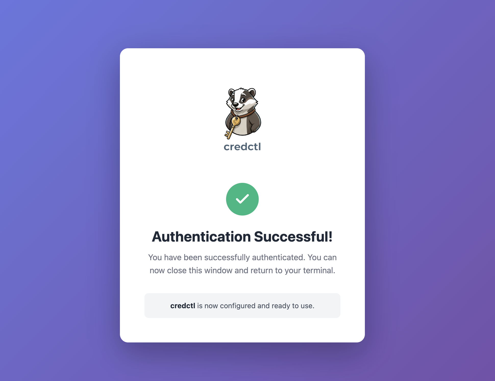

<div align="center">
  
  
  A credential helper daemon that runs on your local machine and provides secure credential access to remote environments via SSH socket forwarding.
</div>

---

## Why credctl?

- 🔒 **Credentials stay on your machine** - Never copy secrets to remote servers
- 🚀 **Works from anywhere** - SSH into servers, Docker containers, dev environments
- 🔑 **Multiple providers** - Command execution, OAuth2/OIDC flows
- 🎯 **Simple** - One daemon, forward the socket, done

## Installation

```bash
make install
```

Or manually:
```bash
go build -o credctl
sudo mv credctl /usr/local/bin/
```

## Quick Start

**1. Start daemon on your local machine:**
```bash
eval $(credctl daemon start)
```

**2. Add a credential provider:**
```bash
# Google OAuth2 example
credctl add oauth2 google \
  --flow=auth-code \
  --client_id=YOUR_CLIENT_ID \
  --use_pkce true
  --issuer=https://accounts.google.com
```

**3. Get credentials:**
```bash
credctl get gh
```

That's it on your local machine! ✅

## Remote Access

Now the magic: use credentials from **anywhere** without copying them.

**SSH with socket forward:**
```bash
ssh -R /tmp/credctl.sock:$HOME/.credctl/agent-readonly.sock user@server
```

**On remote server:**
```bash
export CREDCTL_SOCK=/tmp/credctl.sock
credctl get google    # Opens browser on YOUR local machine!
```

<div align="center">
  
</div>

The OAuth2 flow runs on your local machine - the browser opens locally, you authenticate, and the credential is sent back to the remote server. Your credentials never leave your machine! 🔒

## Providers

credctl supports multiple provider types for credential retrieval

📖 See [docs/providers.md](docs/providers.md) for complete documentation on all available providers.

## Use Cases

- 🐳 **Docker containers** - Mount socket, no secrets in images
- 🔧 **Remote development** - SSH to server, access local credentials
- 🌐 **CI/CD** - Forward socket to build agents
- 📱 **Multiple environments** - One daemon, many remotes
- 🔄 **Credential rotation** - Update once, works everywhere